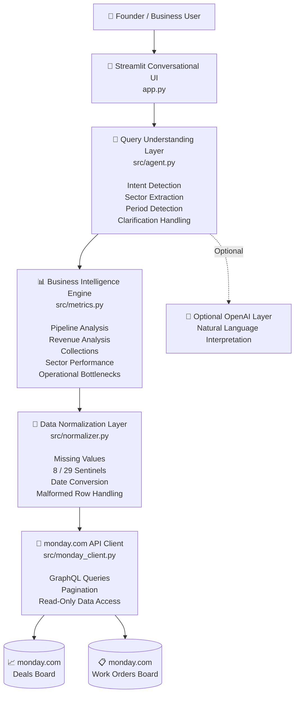
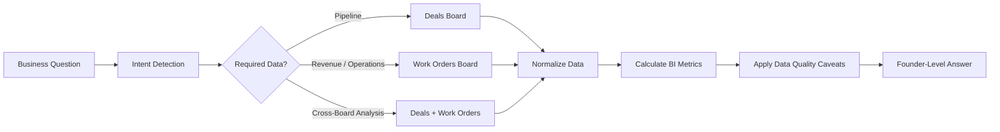
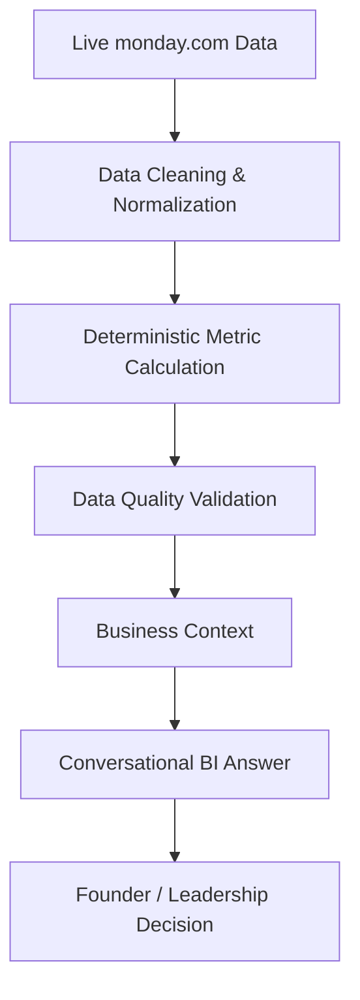
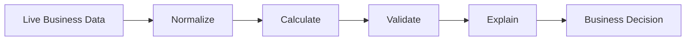

# Skylark Drones monday.com Business Intelligence Agent

A founder-facing conversational **Business Intelligence Agent** that reads live data from two monday.com boards — **Deals** and **Work Orders** — and answers business questions about pipeline, revenue, collections, sector performance, work-order execution, operational bottlenecks, and leadership summaries.

---

## 1. Project Overview

The goal of this project is to provide leadership with a conversational interface for querying business information stored in monday.com.

Instead of manually reviewing multiple boards, a founder or business leader can ask questions such as:

- What is our current pipeline?
- What is our weighted pipeline?
- Show revenue summary.
- How are our work orders performing?
- Which sector has the strongest pipeline?
- Which sector has the highest receivables?
- Compare Mining and Renewables.
- What are our operational bottlenecks?
- Give me a leadership update.

The application dynamically queries the monday.com boards and calculates the requested metrics.

The original Excel files are **not used as the runtime data source** after import into monday.com.

---

# 2. System Architecture

The Skylark Business Intelligence Agent follows a layered architecture that separates the conversational interface, query interpretation, business calculations, data normalization, and monday.com integration.



### Architecture Flow

The system processes a business question through the following flow.

### 1. Founder / Business User

The founder asks a natural-language business question through the Streamlit chat interface.

Example:

```text
Compare Mining and Renewables
```

### 2. Streamlit Conversational Interface

`app.py` receives the question and manages the conversational session.

It also:

- Loads the live monday.com data
- Displays dataset information
- Displays data-quality warnings
- Sends the question to the query-understanding layer
- Displays the final BI answer
- Provides an explainability section

### 3. Query Understanding Layer

`src/agent.py` identifies:

- User intent
- Requested sector
- Comparison sectors
- Requested period
- Required board data
- Whether clarification is necessary

The application supports an optional OpenAI-powered interpretation layer.

If OpenAI API access is unavailable, the deterministic query router continues to provide the core BI functionality.

### 4. Business Intelligence Engine

`src/metrics.py` performs deterministic calculations including:

- Active pipeline
- Weighted pipeline
- Revenue
- Contract value
- Billed value
- Amount remaining to bill
- Collections
- Receivables
- Sector performance
- Work-order status
- Operational bottlenecks

The language model is not relied upon to calculate business values.

### 5. Data Normalization Layer

`src/normalizer.py` cleans the live monday.com records before they are used in calculations.

This includes:

- Converting missing-value sentinel `8` in Deals
- Converting missing-value sentinel `29` in Work Orders
- Handling null and blank values
- Converting Excel serial dates
- Normalizing numbers
- Normalizing dates
- Removing malformed repeated-header-like records

### 6. monday.com Integration Layer

`src/monday_client.py` communicates with the monday.com GraphQL API.

The application retrieves data dynamically from:

- **Deals Board**
- **Work Orders Board**

No CSV or Excel file is used as the runtime source of truth.

### 7. Founder-Level Answer

Calculated business facts are converted into a concise conversational response and returned through Streamlit.

The user can also expand:

```text
How this answer was calculated
```

to inspect the interpreted query plan and calculated facts.

---

## 3. Data Flow Architecture

The following diagram shows how an individual business question moves through the BI system.



This architecture keeps the prototype:

- Simple
- Explainable
- Resilient
- Auditable
- Easy to deploy

The core design principle is that business metrics are calculated from normalized live monday.com data **before** the conversational response is generated.

---

# 4. Technology Stack

## Python

Python was selected because it provides:

- Fast development
- Strong data-processing capabilities
- Simple API integration
- Good support for business analytics
- Easy Streamlit integration

## Streamlit

Streamlit provides the conversational web interface.

It was selected because it:

- Supports rapid prototype development
- Includes built-in chat components
- Requires minimal frontend code
- Can be deployed easily
- Allows the BI prototype to remain a single lightweight service

## monday.com GraphQL API

The application reads live data from monday.com rather than relying on static CSV or Excel files.

GraphQL is used to retrieve:

- Board schema
- Items
- Column values
- Paginated results

## OpenAI — Optional

An OpenAI-powered query interpretation path is supported when an API key and quota are available.

The application also contains a deterministic fallback mode.

This means the core BI functionality continues working even when an OpenAI API key or credits are unavailable.

---

# 5. monday.com Boards

The application reads from two separate monday.com boards.

## Deals Board

Used for:

- Deal status
- Deal value
- Closure probability
- Deal stage
- Sector
- Pipeline analysis
- Weighted pipeline analysis
- Tentative closing dates

## Work Orders Board

Used for:

- Contract value
- Billed value
- Amount remaining to bill
- Collections
- Receivables
- Execution status
- Work-order status
- Billing information
- Sector-level operational analysis

---

# 6. Project Structure

```text
skylark-monday-bi-agent/
│
├── app.py
├── README.md
├── requirements.txt
├── .env.example
├── .gitignore
│
└── src/
    ├── __init__.py
    ├── monday_client.py
    ├── normalizer.py
    ├── metrics.py
    └── agent.py
```

## `app.py`

Main Streamlit application.

Responsibilities:

- Load configuration
- Load Streamlit Cloud secrets
- Connect to monday.com
- Load live board data
- Display conversational interface
- Display data-quality warnings
- Display calculated answers
- Provide explainability information

## `src/monday_client.py`

Handles communication with the monday.com GraphQL API.

Responsibilities:

- Authentication
- Board schema retrieval
- Item retrieval
- Pagination
- API error handling

## `src/normalizer.py`

Cleans and normalizes monday.com data before analysis.

Responsibilities:

- Missing-value handling
- Excel serial date conversion
- Number conversion
- Status normalization
- Malformed-row filtering

## `src/metrics.py`

Contains deterministic BI calculations.

Responsibilities:

- Pipeline
- Weighted pipeline
- Revenue
- Billing
- Collections
- Receivables
- Work-order status
- Sector performance
- Operational bottlenecks

## `src/agent.py`

Handles conversational query understanding and answer generation.

Responsibilities:

- Intent identification
- Sector extraction
- Period extraction
- Clarification questions
- Deterministic fallback routing
- Optional OpenAI integration

---

# 7. Read-Only monday.com Access

The application is designed to operate as a **read-only BI application**.

The monday.com client uses GraphQL queries to retrieve:

- Board schemas
- Board items
- Column values

The application does not implement monday.com mutation operations for modifying board data.

A monday.com personal API token inherits the permissions of the user who created it.

For a production implementation, an OAuth-based monday.com application with explicitly restricted read permissions would be preferable.

---

# 8. Data Quality and Resilience

The source datasets contain several data-quality issues.

The application handles these before performing calculations.

## Missing-Value Sentinels

The source Deals data uses:

```text
8
```

as a missing-value placeholder in several contexts.

The Work Orders data similarly uses:

```text
29
```

as a missing-value placeholder.

These values are normalized to missing values where appropriate instead of being interpreted as real business values.

## Malformed Deals Rows

The source Deals dataset contains repeated-header-like rows.

These rows are identified and removed from business calculations.

## Date Handling

Some source dates originated as Excel serial dates.

The normalization layer supports:

- Excel serial dates
- Numeric date strings
- Standard readable dates
- ISO-like dates

## Missing Business Information

Missing information is not silently converted into business facts.

For example, if an active deal does not contain a deal value, the application reports this as a data caveat rather than treating the value as a genuine zero.

---

# 9. BI Metric Definitions

## Active Pipeline

Active pipeline consists of Deals with status:

```text
Open
On Hold
```

## Known Pipeline Value

```text
Known Pipeline Value =
Sum of available Deal Values for Active Deals
```

Deals without known values are reported separately.

## Weighted Pipeline

Weighted pipeline is calculated only when both deal value and closure probability are available.

```text
Weighted Pipeline =
Deal Value × Closure Probability
```

Probability mapping:

```text
Low     = 25%
Medium  = 50%
High    = 75%
```

## Contract Value

Work-order contract value is based on:

```text
Amount in Rupees (Excl of GST) (Masked)
```

## Billed Value

Based on:

```text
Billed Value in Rupees (Excl of GST.) (Masked)
```

## Amount Remaining to Bill

Based on:

```text
Amount to be billed in Rs. (Exl. of GST) (Masked)
```

## Collections

Based on:

```text
Collected Amount in Rupees (Incl of GST.) (Masked)
```

## Receivables

Based on:

```text
Amount Receivable (Masked)
```

## Operational Status

Operational analysis uses:

```text
Execution Status
WO Status (billed)
```

---

# 10. Cross-Board Analysis

Deals and Work Orders do not provide a consistently reliable shared record-level identifier for every row.

Because of this, the application does **not** force an unreliable row-by-row join.

Instead, cross-board analysis is performed using the common business dimension:

```text
Sector
```

This enables comparisons such as:

```text
Mining vs Renewables
```

across:

- Active pipeline
- Weighted pipeline
- Contract value
- Billed value
- Receivables
- Open work orders

This approach provides more defensible leadership-level analysis than assuming unreliable deal-name matching.

---

# 11. Conversational Query Understanding

The application supports natural-language business questions.

The query-understanding layer identifies the business intent and maps it to the appropriate deterministic metric calculation.

Supported intent categories include:

```text
pipeline

revenue

operations

collections

sector_best_pipeline

sector_best_revenue

sector_best_receivables

sector_detail

sector_compare

bottlenecks

leadership_update

smalltalk
```

Known business sectors include:

```text
Renewables
Mining
Railways
Powerline
Construction
Others
DSP
Tender
```

---

# 12. Supported Questions

Examples of questions supported by the application:

```text
What is our current pipeline summary?

What is our weighted pipeline?

How's our renewables pipeline looking this quarter?

Show revenue summary.

Show collection summary.

Show work order status.

Which sector has the strongest pipeline?

Which sector has the highest revenue?

Which sector has the most receivables?

Show Mining performance.

Show Renewables performance.

Compare Mining and Renewables.

What are our operational bottlenecks?

Give me a leadership update.

Give me an executive summary.
```

---

# 13. Clarification Handling

The agent avoids guessing when a question does not contain enough information.

For example:

```text
Compare sectors
```

produces a clarification request asking which two sectors should be compared.

Similarly:

```text
Show sector performance
```

asks the user which sector should be analyzed.

This prevents unsupported assumptions and improves conversational reliability.

---

# 14. Leadership Update

The agent can generate a leadership-level summary combining information from both monday.com boards.

The update can include:

- Active pipeline
- Known pipeline value
- Weighted pipeline
- Contract value
- Billed value
- Remaining amount to bill
- Collections
- Receivables
- Open work orders
- Closed work orders
- Operational bottlenecks

The current dataset does not provide reliable historical snapshots for every metric.

Therefore, the application avoids inventing week-over-week trends and clearly labels leadership output as a **current-state summary**.

---

# 15. Explainability

For calculated BI answers, the Streamlit interface includes an expandable section:

```text
How this answer was calculated
```

This displays:

- Interpreted query plan
- Calculated facts

Example conceptual flow:

```text
Question
   ↓
Intent
   ↓
Required Board(s)
   ↓
Normalized Data
   ↓
BI Calculation
   ↓
Calculated Facts
   ↓
Conversational Answer
```

This makes the prototype easier to validate and demonstrates that business values are calculated from the source data rather than invented during response generation.

---

# 16. Error Handling

The application handles common failures gracefully.

Examples include:

- Missing monday API token
- Missing board IDs
- monday.com API request errors
- Invalid or inaccessible boards
- Missing data
- Invalid date values
- Missing numeric values
- OpenAI API failures

If the OpenAI API is unavailable, the application automatically uses the deterministic BI fallback rather than causing the entire application to fail.

---

# 17. Local Setup

## Step 1 — Clone the Repository

```bash
git clone YOUR_GITHUB_REPOSITORY_URL
```

Move into the project directory:

```bash
cd skylark-monday-bi-agent
```

---

## Step 2 — Install Dependencies

```bash
pip install -r requirements.txt
```

---

## Step 3 — Create `.env`

Create a file named:

```text
.env
```

Add:

```env
MONDAY_API_TOKEN=your_private_monday_token

MONDAY_DEALS_BOARD_ID=your_deals_board_id

MONDAY_WORK_ORDERS_BOARD_ID=your_work_orders_board_id

OPENAI_API_KEY=

OPENAI_MODEL=gpt-4.1-mini
```

`OPENAI_API_KEY` can remain empty when running the deterministic fallback mode.

Never commit the real `.env` file to GitHub.

---

## Step 4 — Run the Application

```bash
streamlit run app.py
```

Streamlit will display the local application URL in the terminal.

---

# 18. Streamlit Community Cloud Deployment

The application can be deployed directly from GitHub using Streamlit Community Cloud.

Deployment configuration:

```text
Repository:
YOUR_GITHUB_REPOSITORY

Branch:
main

Main file path:
app.py
```

Open:

```text
Advanced settings
```

and add the following Streamlit secrets:

```toml
MONDAY_API_TOKEN = "your_private_monday_token"

MONDAY_DEALS_BOARD_ID = "your_deals_board_id"

MONDAY_WORK_ORDERS_BOARD_ID = "your_work_orders_board_id"
```

The OpenAI API key is optional.

The application supports both:

```text
Local Development
        ↓
      .env
```

and:

```text
Streamlit Community Cloud
        ↓
Streamlit Secrets
```

without requiring separate application code.

---

# 19. Security

Sensitive credentials must never be committed to GitHub.

The `.gitignore` file excludes:

```text
.env

.venv/

venv/

__pycache__/

*.pyc

.streamlit/secrets.toml
```

The repository can contain:

```text
.env.example
```

but must never contain the real `.env` file.

API tokens should be stored using:

- `.env` for local development
- Streamlit Secrets for hosted deployment

---

# 20. Deterministic Fallback Mode

The application supports an optional OpenAI integration.

However, the BI application is designed so that the core analytics do not depend on an external language model.

When an OpenAI API key or quota is unavailable, the application automatically switches to:

```text
Deterministic BI Fallback Mode
```

The fallback router identifies common business intents and routes them to deterministic calculations.

This provides two advantages:

1. The application remains usable even if an external AI service is unavailable.
2. Business metrics remain deterministic and auditable.

The OpenAI layer is therefore used primarily for enhanced natural-language interpretation rather than as the source of business calculations.

---

# 21. Data-to-Decision Flow



The application is therefore designed as a **data-to-decision system**, rather than simply a chatbot connected to business data.

---

# 22. Known Limitations

1. The deterministic fallback supports a defined set of BI intents. An enabled LLM can provide broader natural-language interpretation.

2. Reliable historical trends require historical snapshots. The application does not invent week-over-week trends from current-state data.

3. Cross-board analysis is performed at sector level because a consistently reliable record-level join key is not available across both datasets.

4. Some Work Order fields contain substantial missing data.

5. Imported monday.com column types are not completely uniform, so the normalization layer defensively reads displayed values.

6. A personal monday.com API token inherits the permissions of the user who created it.

7. The prototype prioritizes correctness, explainability, resilience, and delivery speed over production-scale infrastructure.

---

# 23. Design Decisions

The prototype uses:

```text
Streamlit + Python
```

instead of a larger frontend/backend architecture.

This was selected because it:

- Reduces implementation complexity
- Supports rapid prototyping
- Provides a built-in conversational interface
- Simplifies deployment
- Leaves more development time for data quality
- Leaves more development time for BI logic
- Keeps the prototype easy to review

Business calculations are implemented deterministically rather than asking an LLM to calculate metrics directly.

This improves:

- Reliability
- Reproducibility
- Explainability
- Auditability

---

# 24. Future Improvements

Possible production improvements include:

- OAuth-based monday.com authentication
- Explicit read-only monday.com application scopes
- Historical snapshots for trend analysis
- Scheduled leadership reports
- Improved entity matching across Deals and Work Orders
- More flexible natural-language query planning
- Additional visual dashboards
- Interactive charts
- Automated metric tests
- Caching optimization for larger boards
- User authentication
- Role-based access control
- Automated leadership notifications
- More advanced cross-board relationship detection

---

# 25. Submission Deliverables

The final project submission contains:

```text
1. Hosted Streamlit Prototype

2. GitHub Source Repository

3. README.md

4. Source Code ZIP

5. 2-Page Decision Log
```

The hosted prototype demonstrates:

- Live monday.com integration
- Conversational querying
- Pipeline BI
- Revenue BI
- Collections BI
- Operational BI
- Sector comparisons
- Data-quality handling
- Clarification behavior
- Leadership summaries
- Explainable calculations

---

# 26. Final Design Principle

The central principle of this project is:

> **Calculate first, explain second.**

The system derives business metrics from normalized live monday.com data before producing the conversational answer.



This approach keeps the Business Intelligence Agent useful for leadership while ensuring that missing, incomplete, or unreliable data is surfaced rather than hidden.

---

## Author

**Skylark Drones Business Intelligence Agent — Technical Assignment**

Built using:

- Python
- Streamlit
- monday.com GraphQL API
- Deterministic Business Intelligence
- Optional OpenAI Integration